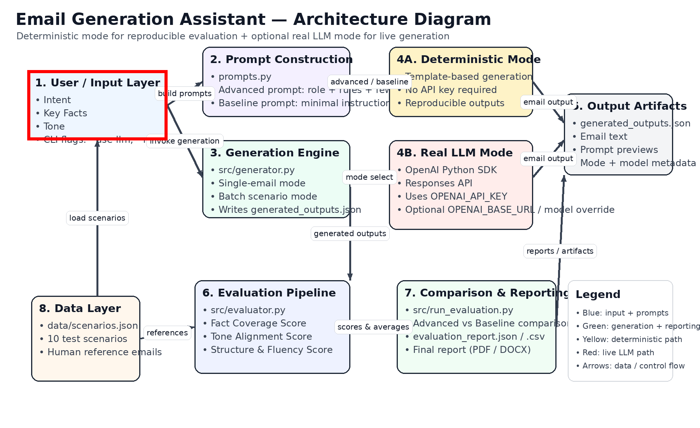

# 🚀 Email Generation Assistant

An AI-powered system that generates professional emails from structured inputs, evaluates output quality using custom metrics, and compares prompting strategies to determine the most reliable production approach.

## 🔥 Highlights

- Advanced Prompt Engineering (Role-based + Few-shot)
- Custom LLM Evaluation Metrics (Fact, Tone, Structure)
- Deterministic vs Real LLM Comparison
- Production-ready Architecture
---

## 🏗️ Architecture Diagram

The system is designed with a modular pipeline that supports both deterministic evaluation and real LLM-based generation.



### 🔍 Flow Overview

1. **Input Layer**
   - User provides intent, key facts, and tone

2. **Prompt Construction**
   - Advanced prompt (role-based + few-shot)
   - Baseline prompt (minimal instruction)

3. **Generation Engine**
   - Processes prompts via:
     - Deterministic templates (for reproducibility)
     - Real LLM (via OpenAI API)

4. **Output Layer**
   - Generates structured professional emails
   - Stores results in JSON format

5. **Evaluation Pipeline**
   - Applies custom metrics:
     - Fact Coverage
     - Tone Alignment
     - Structure & Fluency

6. **Reporting & Comparison**
   - Compares baseline vs advanced strategies
   - Outputs CSV/JSON reports and final analysis

---

### ⚙️ Key Design Principles

- **Deterministic Mode** → ensures reproducible evaluation  
- **LLM Mode** → enables real-world generation  
- **Modular Architecture** → easy to extend and integrate with APIs  
- **Evaluation-Driven Design** → focuses on measurable output quality  
- 
## ✨ Overview

This project implements a prompt-engineered Email Generation Assistant that:

- Generates high-quality emails using:
  - **Intent**
  - **Key Facts**
  - **Tone**
- Compares:
  - **advanced_prompt**
  - **baseline_prompt**
- Evaluates outputs using custom-designed metrics
- Produces quantitative and qualitative analysis
- Supports both:
  - **deterministic mode** for reproducible offline evaluation
  - **real LLM mode** using the OpenAI Responses API

---

## 📦 What’s Included

- Email generation engine (`generator.py`)
- 10 evaluation scenarios with human reference emails
- Prompt strategy comparison:
  - `advanced_prompt`
  - `baseline_prompt`
- 3 custom evaluation metrics:
  - Fact Coverage Score
  - Tone Alignment Score
  - Structure & Fluency Score
- Outputs:
  - JSON + CSV evaluation reports
- Final report:
  - PDF + DOCX

---

## 🧠 Prompt Engineering Strategy

The advanced prompting approach combines:

1. **Role-Based Prompting**  
   The model acts as an executive communications specialist.

2. **Instruction Scaffolding**  
   Explicit constraints for subject line, greeting, body structure, tone consistency, and closing.

3. **Few-Shot Guidance**  
   A compact example demonstrates the desired format and style.

This improves reliability over a minimal baseline prompt by increasing factual coverage, structural consistency, and tone adherence.

---

## 📁 Project Structure

```text
email_generation_assistant/
├── data/
│   └── scenarios.json
├── outputs/
│   ├── generated_outputs.json
│   ├── evaluation_report.csv
│   └── evaluation_report.json
├── report/
│   ├── Final_Report.docx
│   └── Final_Report.pdf
├── src/
│   ├── prompts.py
│   ├── generator.py
│   ├── evaluator.py
│   └── run_evaluation.py
├── README.md
└── requirements.txt
```

---

## ⚙️ Setup Instructions

```bash
python -m venv .venv
source .venv/bin/activate     # Mac/Linux
# OR
.venv\Scripts\activate      # Windows

pip install -r requirements.txt
```

---

## 🚀 How to Run the Email Generator

### 1. Run in Deterministic Mode

This requires **no API key** and keeps the project reproducible.

```bash
cd src
python generator.py
```

This generates output for all scenarios and writes:

- `outputs/generated_outputs.json`

---

### 2. Run in Real LLM Mode

Set your API key first:

```bash
export OPENAI_API_KEY="your_api_key_here"
```

Then run:

```bash
cd src
python generator.py --use-llm
```

Optional model override:

```bash
cd src
python generator.py --use-llm --model gpt-5.4
```

The below command is for me, becz I dont have 5.4 available for my openai account.
```bash
cd src
python generator.py --use-llm --model gpt-4.1-mini
```

Optional base URL override:

```bash
cd src
python generator.py --use-llm --base-url https://api.openai.com/v1
```

---

### 3. Generate a Single Custom Email

Deterministic:

```bash
cd src
python generator.py   --strategy advanced   --intent "Follow up after client meeting"   --tone professional   --facts "Discussed pricing options" "Client interested in enterprise plan" "Need confirmation by Friday"
```

Real LLM:

```bash
cd src
python generator.py   --use-llm   --strategy advanced   --intent "Follow up after client meeting"   --tone professional   --facts "Discussed pricing options" "Client interested in enterprise plan" "Need confirmation by Friday"
```

Optional output file:

```bash
cd src
python generator.py   --use-llm   --strategy advanced   --intent "Request for proposal"   --tone formal   --facts "Budget is $50k" "Timeline is 2 months"   --output ../outputs/single_email.txt
```

---

## 🧪 Run Full Evaluation

```bash
cd src
python run_evaluation.py
```

This generates:

- `outputs/generated_outputs.json`
- `outputs/evaluation_report.json`
- `outputs/evaluation_report.csv`

If you want the evaluation to use real LLM-generated outputs, first run:

```bash
cd src
python generator.py --use-llm
python run_evaluation.py
```

---

## 📏 Custom Evaluation Metrics

### 1. Fact Coverage Score
Measures whether each required fact appears in the generated email.

**Logic**
- Tokenize each fact
- Check whether enough meaningful fact tokens appear in the output
- Score = covered facts / total facts

### 2. Tone Alignment Score
Measures how well the generated email matches the requested tone.

**Logic**
- Use tone-specific lexical markers
- Apply light penalties for mismatched style patterns
- Normalize to a 0–1 score

### 3. Structure & Fluency Score
Measures whether the email looks like a polished professional message.

**Checks**
- subject line
- greeting
- professional closing
- appropriate length
- paragraph structure

---

## 📊 Results Summary

| Strategy         | Avg Score |
|-----------------|-----------|
| Advanced Prompt | 0.833     |
| Baseline Prompt | 0.447     |

---

## 🧠 Key Insights

- The advanced prompt strategy performs better overall.
- The baseline prompt’s biggest failure mode is incomplete fact recall and weaker formatting discipline.
- The advanced strategy is the better production candidate because it delivers more reliable structure, better factual inclusion, and stronger tone consistency.

---

## 🏆 Recommendation

Use **advanced_prompt** in production.

Use **deterministic mode** when you want reproducible offline assessment results.

Use **real LLM mode** when you want a live demo or a more realistic production-style generation workflow.

---

## 👤 Author

**Samarth Narula**  
Cloud Architect | AI Engineer | Full Stack Developer

---

## ⭐ Final Note

This project demonstrates:
- Prompt Engineering
- Evaluation Design
- Model/Strategy Comparison
- Production Thinking
